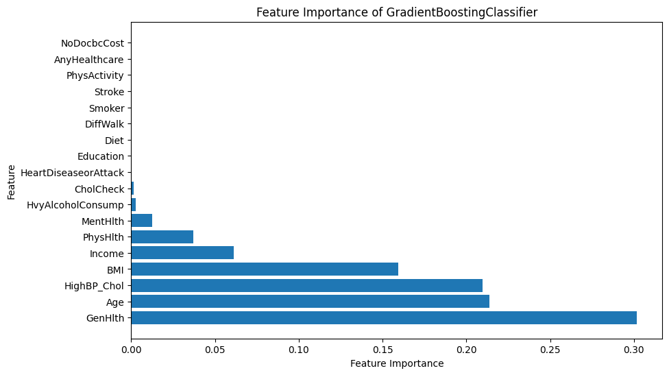

# **Diabetes Solutions Hackathon**
Contributors : Jimcollins Wamae, Rosemary Mburu, and Stella Kitur

## **Project Overview**

Diabetes affects millions worldwide, posing a significant public health challenge. Early detection and intervention are vital to managing this chronic metabolic disorder effectively. Research tells us that by the year 2030, in Kenya alone we expect that the total diabetes expenditure would be approximately KES 27.3 million, and that would increase to KES 42.5 million by the year 2045.  
Shocking.  
Diabetes, not only impacts at a national level, the impact of its magnitude can be felt at an individual level, as well as those that are close to the person.  
So why does it matter?  
As the *Sugar Control Squad*, we aren't just working on another data science project, but we believe that contributing to finding a solution to diabetes is a life-saving expedition. We aim to develop a predictive model to identify individuals that are at risk of developing diabetes. By leveraging advanced machine learning algorithms and diverse datasets encompassing medical records, lifestyle factors, and demographic information.

## **Problem Statement**

The challenge at hand is to develop a predictive model that can accurately identify individuals at risk of developing diabetes. Leveraging machine learning algorithms and diverse datasets, the model must find meaningful features that contribute to a person's diabetic status, with F1 score as the main success metric – a crucial harmony of precision and recall, particularly relevant in medical cases.

## **Project Objectives**
The primary goal is to find meaningful inferences(features) which in turn will be used in identifying Diabetes in a person, the objectives of the project are therefore the following:    
1. **Develop a High-Performing Predictive Model:** Create a robust predictive model with a high F1 score that accurately identifies individuals at risk of developing diabetes. The model will leverage advanced machine learning algorithms and diverse datasets encompassing medical records, lifestyle factors, and demographic information. Achieving a high F1 score ensures a balance between precision and recall, making it well-suited for medical applications.

2. **Uncover Key Factors in Diabetes Risk:** Conduct in-depth feature analysis to identify the most significant factors contributing to an individual's diabetic status. Understanding these key risk factors will provide valuable insights for healthcare professionals, enabling targeted interventions and personalized preventive measures.

3. **Empower Individuals for Proactive Health Management:** Empower individuals to take charge of their health by providing educational resources and personalized lifestyle recommendations based on their risk assessment results. By promoting proactive health management, the project aims to reduce diabetes risk factors and foster a healthier society.

### **Success Metrics**

In our pursuit of developing an accurate predictive model, we have carefully chosen the F1 score as our primary success metric. The F1 score strikes a perfect balance between precision and recall, making it particularly well-suited for medical applications. By prioritizing the F1 score, we ensure that our model excels in identifying both true positive cases and minimizing false negatives, crucial in the context of diabetes risk prediction. This choice aligns with best practices in medical research, guaranteeing that our project's success is measured against the most relevant and impactful metric.
## **Data Understanding**

The data for this project was sourced from [Kaggle](https://www.kaggle.com/datasets/alexteboul/diabetes-health-indicators-dataset) and consists of 253,680 rows and 22 columns. It includes valuable information collected from the Behavioral Risk Factor Surveillance System (BRFSS), a health-related telephone survey conducted annually by the CDC. The survey captures responses from over 400,000 Americans, providing insights into health-related risk behaviors, chronic health conditions, and the utilization of preventive services.
### Columns Description

These are the columns in the dataset as well as what they represent.

| Column Name        | Description                                                                                                                                                      | Categories/Scale                                    |
|--------------------|------------------------------------------------------------------------------------------------------------------------------------------------------------------|-----------------------------------------------------|
| `Diabetes_Status`       | Diabetes status of the individual                                                                                                                               | 0 = no diabetes 1 = prediabetes 2 = diabetes   |
| `HighBP`             | High blood pressure status of the individual                                                                                                                     | 0 = no high BP 1 = high BP                        |
| `HighChol`           | High cholesterol status of the individual                                                                                                                       | 0 = no high cholesterol 1 = high cholesterol      |
| `CholCheck`          | Whether the individual had a cholesterol check in the past 5 years                                                                                               | 0 = no cholesterol check 1 = cholesterol check    |
| `BMI`                | Body Mass Index of the individual                                                                                                                                | Numeric value representing BMI                      |
| `Smoker`             | Smoking status of the individual                                                                                                                                 | 0 = not a smoker 1 = smoker                       |
| `Stroke`             | Whether the individual has ever been told they had a stroke                                                                                                      | 0 = no stroke 1 = stroke                          |
| `HeartDiseaseorAttack` | Whether the individual has coronary heart disease (CHD) or myocardial infarction (MI)                                                                           | 0 = no heart disease or attack 1 = heart disease or attack |
| `PhysActivity`       | Whether the individual engaged in physical activity in the past 30 days (excluding job-related activity)                                                        | 0 = no physical activity 1 = physical activity     |
| `Fruits`             | Whether the individual consumes fruits one or more times per day                                                                                                | 0 = does not consume fruits 1 = consumes fruits    |
| `Veggies`            | Whether the individual consumes vegetables one or more times per day                                                                                            | 0 = does not consume vegetables 1 = consumes vegetables |
| `HvyAlcoholConsump`  | Whether the individual is a heavy alcohol consumer                                                                                                              | 0 = not a heavy alcohol consumer 1 = heavy alcohol consumer |
| `AnyHealthcare`      | Whether the individual has any kind of health care coverage, including health insurance, prepaid plans, etc.                                                   | 0 = no healthcare coverage 1 = healthcare coverage  |
| `NoDocbcCost`        | Whether there was a time in the past 12 months when the individual needed to see a doctor but could not due to cost constraints                              | 0 = no, did not experience cost constraints 1 = yes, experienced cost constraints |
| `GenHlth`            | Self-rated general health of the individual on a scale of 1 to 5                                                                                                 | 1 = excellent 2 = very good 3 = good 4 = fair 5 = poor |
| `MentHlth`           | Number of days during the past 30 days when the individual's mental health was not good (scale: 1 to 30 days)                                                    | Numeric value representing the number of days       |
| `PhysHlth`           | Number of days during the past 30 days when the individual's physical health was not good (scale: 1 to 30 days)                                                 | Numeric value representing the number of days       |
| `DiffWalk`           | Whether the individual has serious difficulty walking or climbing stairs                                                                                        | 0 = no, no difficulty walking 1 = yes, difficulty walking |
| `Sex`                | Gender of the individual                                                                                                                                         | 0 = female 1 = male                              |
| `Age`                | Age category of the individual                                                                                                                                   | 1 = 18-24 9 = 60-64 13 = 80 or older           |
| `Education`          | Education level of the individual                                                                                                                                | 1 = Never attended school or only kindergarten 2 = Grades 1 through 8 (Elementary) 3 = Grades 9 through 11 (Some high school) 4 = Grade 12 or GED (High school graduate) 5 = College 1 year to 3 years (Some college or technical school) 6 = College 4 years or more (College graduate) |
| `Income`             | Income scale of the individual                                                                                                                                   | 1 = less than $10,000   5 = less than $35,000  8 = $75,000 or more |

##  **Data Cleaning**
During this phase of the analysis, several preprocessing steps were performed to prepare the data for analysis and modeling. These steps included handling outliers, feature engineering and other necessary techniques for the retention of data integrity. 
## **Model Evaluation**
The models utilised include: 
1. Gradient Boost
2. Random Forest
3. Logistic Regression 

The best performing model was the Gradient Boost & based on the feature importance, the top factors that influence an individual's diabetic status is illustrated below. 

# **Recommendations & Next Steps**

#### Increased Awareness/Education on Diabetes
Given the rising prevalence of diabetes, it is crucial to prioritize public awareness and education initiatives about the disease. By fostering a better understanding of the risk factors, prevention measures, and early symptoms, we can empower individuals to take proactive steps towards managing their health effectively.

#### Leveraging the Power of the Gradient Boost Model
The remarkable performance of the Gradient Boost model positions it as a powerful tool for healthcare providers and policymakers. Integrating this model into clinical practice can aid in identifying individuals at risk of diabetes promptly, facilitating timely interventions, and ultimately improving patient outcomes.

#### Enhancing Data Collection and Model Performance
To further enhance the model's predictive capabilities, obtaining more localized and comprehensive data specific to the target population is essential. Collecting data that reflects regional and cultural variations will improve the model's accuracy and effectiveness, leading to more personalized and tailored healthcare solutions. Additionally, continuously updating the model with real-time data will ensure its relevance and applicability over time.

By implementing these recommendations and taking the necessary steps, we can make significant strides in combating diabetes and promoting a healthier society. The journey towards diabetes prevention and management requires collective efforts from healthcare professionals, policymakers, and the community at large.

#### <b> Project Contributors </b>
Special thanks to African Tech Girl and Africa's Talking for hosting this hackathon. 

1. [Jimcollins Wamae](https://github.com/JIMWAMAE)
2. [Rosemary Mburu](https://github.com/NyakioRosemary)
3. [Stella Kitur](https://github.com/stellacherotich)